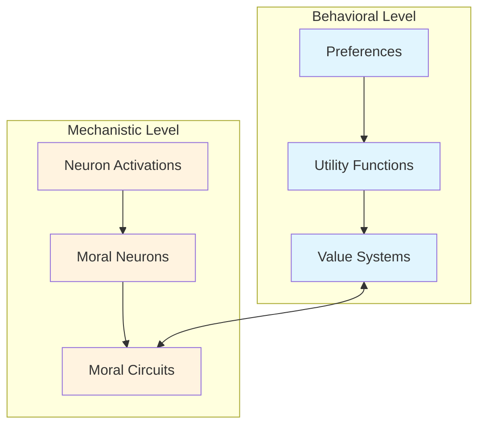
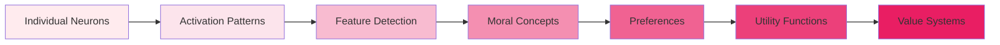

# Core Concepts Overview

This page introduces the fundamental concepts behind the Moral Circuit Analysis framework with Utility Engineering integration.

## The Two-Level Approach

Our framework analyzes moral reasoning in LLMs at two complementary levels:



### 1. Mechanistic Level (Bottom-up)
- **What**: Individual neurons and their activation patterns
- **How**: Analyzing responses to moral/immoral stimuli
- **Output**: Identified moral neurons and circuits

### 2. Behavioral Level (Top-down)
- **What**: Preferences and value systems
- **How**: Eliciting choices and fitting utility functions
- **Output**: Coherent utility models

## Key Concepts

### Moral Neurons

Neurons that show significantly different activation patterns when processing moral vs. immoral content.

**Characteristics:**
- Consistent activation differences (Δ > threshold)
- High response reliability across examples
- Layer-specific distribution patterns

**Example:**
```python
# Neuron (Layer 12, Index 547)
# Moral text: "I helped the injured bird" → Activation: 8.3
# Immoral text: "I ignored the injured bird" → Activation: 2.1
# Difference: 6.2 (significant)
```

### Moral Circuits

Networks of co-activating neurons that work together to process moral information.

**Properties:**
- Distributed across multiple layers
- Show coordinated activation patterns
- May specialize by moral dimension

### Utility Functions

Mathematical representations of preference orderings over outcomes.

**Thurstonian Model:**
- Each outcome has utility U(o) ~ N(μ(o), σ²(o))
- Preference probability: P(A > B) = Φ((μ_A - μ_B)/√(σ²_A + σ²_B))
- Captures uncertainty in preferences

### Value Coherence

The degree to which preferences form a consistent, transitive ordering.

**Metrics:**
- **Completeness**: Can compare any two outcomes
- **Transitivity**: If A > B and B > C, then A > C
- **Model Accuracy**: How well utilities predict preferences

## Moral Dimensions

Based on Moral Foundation Theory, we analyze six dimensions:

1. **Care/Harm**: Concern for others' well-being
2. **Fairness/Cheating**: Justice and reciprocity
3. **Loyalty/Betrayal**: Group cohesion and solidarity
4. **Authority/Subversion**: Respect for hierarchy
5. **Sanctity/Degradation**: Purity and contamination
6. **Liberty/Oppression**: Freedom and autonomy

## Integration Insights

The power of our approach comes from connecting these levels:

### 1. Validation
- Do identified moral neurons contribute to coherent preferences?
- Can utility values be predicted from neuron activations?

### 2. Causality
- Does ablating moral circuits disrupt utility coherence?
- Which neurons are necessary for value representations?

### 3. Emergence
- How do distributed neurons give rise to unified values?
- At what scale do coherent utilities emerge?

## Theoretical Foundations

### From Neurons to Values



### Expected Utility Property

For a coherent value system:
- U(lottery) = Σ p_i × U(outcome_i)
- Combines beliefs (probabilities) with values (utilities)
- Enables decision-making under uncertainty

### Preference Elicitation

We use forced-choice prompts with multiple framings:
- Reduces framing effects
- Captures preference uncertainty
- Enables robust utility fitting

## Research Questions

This framework addresses:

1. **Existence**: Do LLMs have meaningful value systems?
2. **Structure**: How are values represented mechanistically?
3. **Coherence**: Are LLM values internally consistent?
4. **Control**: Can we modify values through targeted interventions?
5. **Alignment**: Do LLM values align with human values?

## Next Steps

- [Moral Neurons](moral-neurons.md) - Deep dive into neuron identification
- [Utility Functions](utility-functions.md) - Understanding preference modeling
- [Integration](integration.md) - Connecting mechanisms to behavior