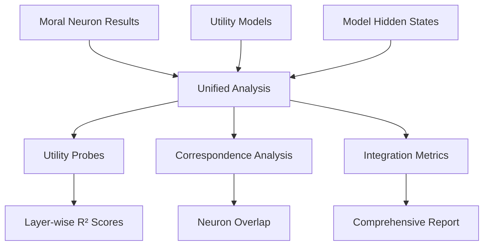

# Unified Analysis Pipeline

The unified analysis connects mechanistic (neuron-level) and behavioral (utility-level) analyses to provide comprehensive insights into moral reasoning.

## Overview



## Prerequisites

Before running unified analysis, ensure you have:

1. ✅ Completed moral neuron analysis
2. ✅ Fitted utility models for dimensions
3. ✅ Elicited preferences from the model

## Running Unified Analysis

### Basic Command

```bash
python scripts/run_unified_analysis.py \
    --model "google/gemma-2b" \
    --preferences results/preferences_elicited.json \
    --utility-models results/utility_models \
    --moral-results results/moral_analysis.pkl \
    --output-dir results/unified_analysis
```

### Parameters

- `--model`: Model name (must match moral analysis)
- `--preferences`: Path to elicited preferences
- `--utility-models`: Directory with fitted utility models
- `--moral-results`: Moral neuron analysis results
- `--output-dir`: Where to save unified analysis

## Analysis Components

### 1. Utility Probe Training

Trains linear probes to predict utility values from hidden states:

```python
# For each layer:
probe = Ridge(alpha=1.0)
probe.fit(hidden_states, utility_values)
r2_score = probe.score(test_hidden_states, test_utilities)
```

**Key Metrics:**
- Layer-wise R² scores
- Best performing layers
- Weight magnitudes

### 2. Neuron Correspondence Analysis

Identifies overlap between:
- Moral neurons (from activation analysis)
- Utility neurons (from probe weights)

```python
# High-weight neurons in utility probe
utility_neurons = neurons_with_weight > threshold

# Overlap with moral neurons
overlap = moral_neurons ∩ utility_neurons
overlap_ratio = |overlap| / |moral_neurons|
```

### 3. Cross-Validation

Tests whether moral neurons predict utility values:

1. Extract activations of moral neurons
2. Train predictor: activations → utilities
3. Evaluate prediction accuracy

## Output Structure

```
results/unified_analysis/
├── utility_probe_analysis.json      # Probe training results
├── care_unified_analysis.json       # Per-dimension analysis
├── fairness_unified_analysis.json
├── ...
└── unified_analysis_summary.json    # Overall summary
```

### Sample Output

```json
{
  "dimension": "care",
  "probe_results": {
    "5": {"test_r2": 0.234, "train_r2": 0.456},
    "10": {"test_r2": 0.567, "train_r2": 0.678},
    "15": {"test_r2": 0.823, "train_r2": 0.891}
  },
  "best_probe_layer": 15,
  "best_probe_r2": 0.823,
  "n_utility_neurons": 47,
  "n_moral_neurons": 156,
  "neuron_overlap": 31,
  "overlap_ratio": 0.199
}
```

## Interpretation Guide

### High Probe R² (>0.7)
- Strong utility representations in hidden states
- Model has developed coherent value encoding
- Layer likely important for value processing

### High Overlap Ratio (>0.3)
- Moral neurons directly involved in utility representation
- Strong mechanistic-behavioral connection
- Validates neuron identification method

### Layer Distribution
- Early layers: Basic feature detection
- Middle layers: Concept formation
- Later layers: Value integration

## Advanced Analysis

### 1. Dimension-Specific Patterns

```python
# Compare utility encoding across dimensions
for dimension in ['care', 'fairness', 'loyalty']:
    results = analyze_dimension(dimension)
    plot_layer_profiles(results)
```

### 2. Cross-Dimension Integration

```python
# Test if same neurons encode multiple dimensions
cross_dim_neurons = find_shared_utility_neurons(
    dimensions=['care', 'fairness']
)
```

### 3. Temporal Analysis

```python
# How utility representations build up over sequence
utility_trajectory = track_utility_over_tokens(
    text="I should help the injured...",
    layer=best_layer
)
```

## Visualization

Generate comprehensive visualizations:

```bash
python scripts/generate_utility_visualizations.py \
    --probe-results results/unified_analysis/utility_probe_analysis.json \
    --output-dir results/visualizations
```

Creates:
- Layer-wise probe accuracy plots
- Neuron overlap diagrams
- Utility encoding heatmaps

## Troubleshooting

### Low Probe Accuracy

**Possible Causes:**
- Insufficient preference data
- Model too small for coherent utilities
- Utilities not linearly decodable

**Solutions:**
- Collect more preference data
- Try non-linear probes
- Focus on larger models

### No Neuron Overlap

**Possible Causes:**
- Different mechanisms for morality vs. utility
- Threshold too strict
- Distributed representation

**Solutions:**
- Adjust overlap thresholds
- Analyze activation patterns
- Consider ensemble effects

## Best Practices

1. **Consistent Model Versions**: Ensure same model used throughout pipeline
2. **Sufficient Data**: At least 100 preferences per dimension
3. **Multiple Runs**: Average results across random seeds
4. **Validation**: Cross-check findings with ablation studies

## Next Steps

- [Ablation Studies](ablation.md) - Test causal relationships
- [Visualization Guide](../results/visualizations.md) - Understand outputs
- [Advanced Workflows](../tutorials/advanced-workflows.md) - Complex analyses